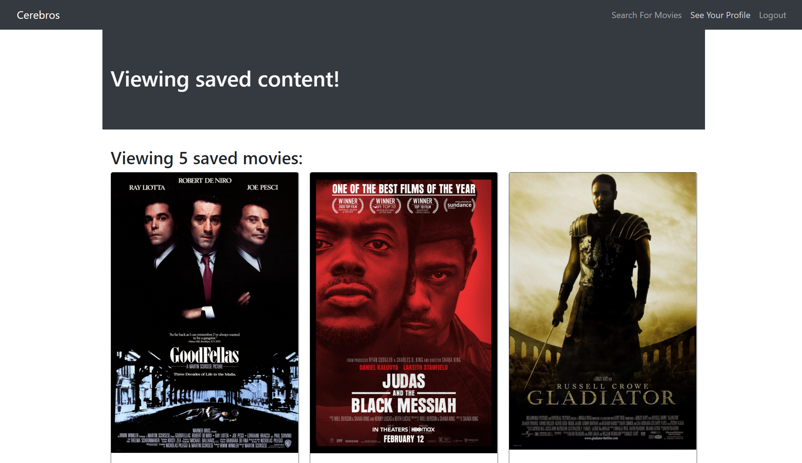

<<<<<<< HEAD

=======

# Cerebros

<a href="https://choosealicense.com/licenses/mit" target="_blank"></a>


## Table of Contents


- [Description](#description)
- [Demonstration](#demonstration)
- [Installation](#installation)
- [Usage](#usage)


## Description

The [Cerebros](https://fast-earth-08103.herokuapp.com/) movie search app allows users to search for movies.

## Demonstration



## Installation

Clone this repository. Open the respository in a code editor such as VS Code.

1. Run npm install to ensure all required dependencies and node modules are installed.

```bash
npm install
```

2. Run "npm run develop" to begin your application at port 3000 localhost.

```bash
npm run develop
```

## Usage

1. Select [Sign Up/Login] from the navbar.

   - To Sign Up as afirst time user, select [Sign Up] and enter a username, email address and password. Click 'Submit'.
   - To Login, select [Login] and enter your email and password.Click 'Submit'.
2. Select [Search for Movies] from the navbar.

   - In the 'Search for a movie' search box, type any move you would like to search for. Press 'Submit Search' button. Results will then be displayed.

## Link

Heroku Link: [Cerebros](https://fast-earth-08103.herokuapp.com/)

>>>>>>> ead9deda322730ff17282783835486c6598b3808
>>>>>>>
>>>>>>
>>>>>
>>>>
>>>
>>
